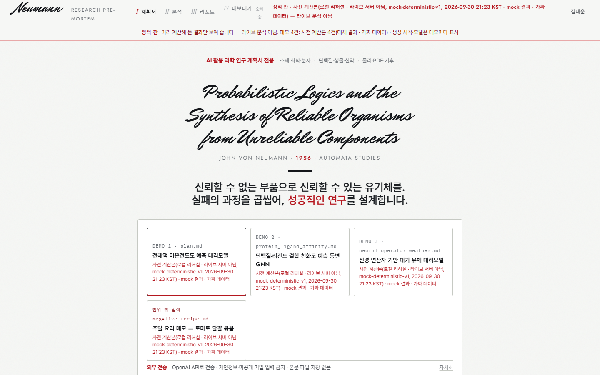
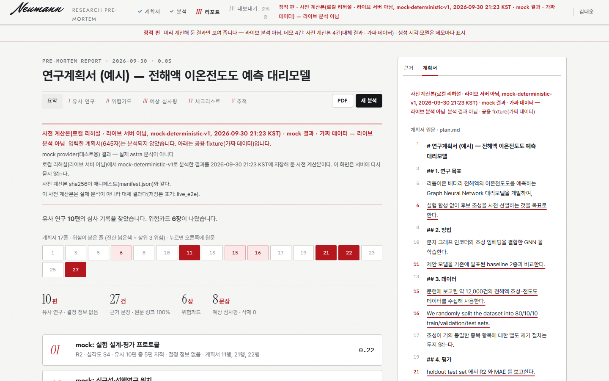
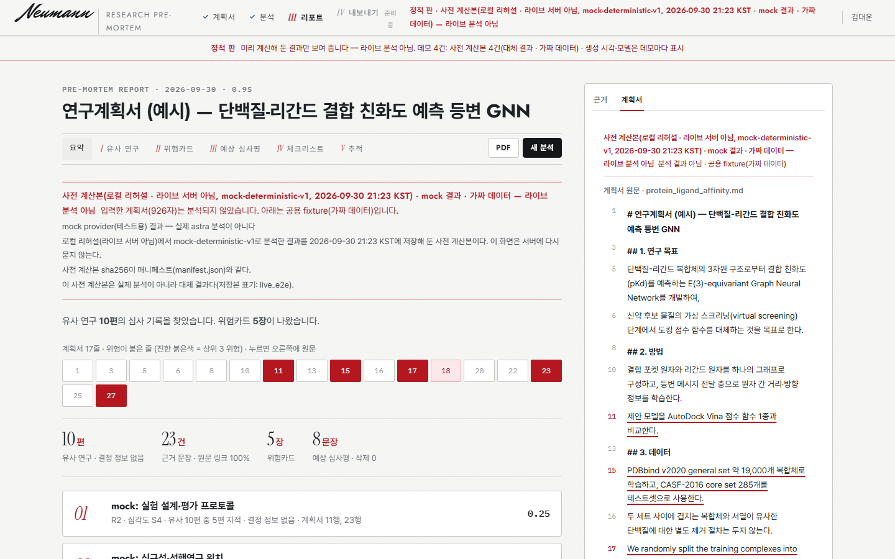
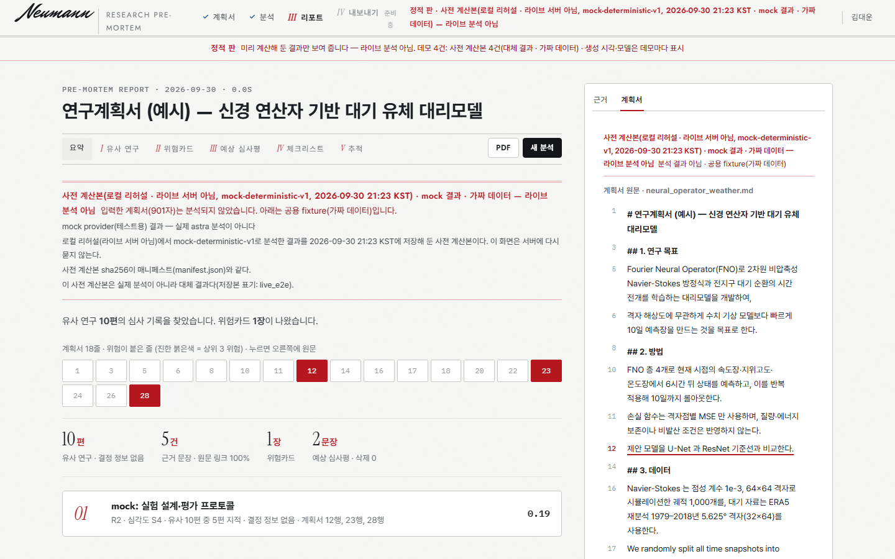
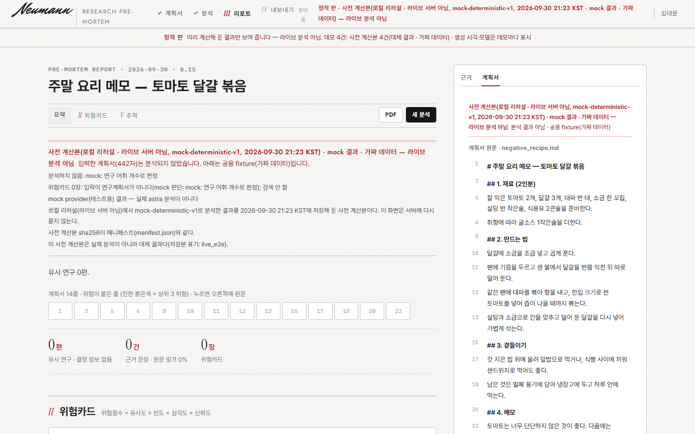

# E6-L3d 보고서 — v1 라이브 결과를 사전 계산본·정적 판·시연 녹화에 쓰기(추가 API 없음)

- 빌더: Claude Opus 5.5 · 브랜치 `task/E6-L3d`(main `4cbf0f0` 기준) · 2026-09-30
- 실제 OpenAI 호출 0건. 모든 명령은 `NEUMANN_LLM_PROVIDER=mock`으로 돌렸고 `NEUMANN_LIVE_LLM_OK`는 켜지 않았다.

## 상태: 준비 완료, 라이브 결과 대기

- E5-L1e2e 라이브 실행(21:13~21:24)은 결과 JSON을 남기지 않았다(PM 확인). 그 워크트리에는 저장 코드만 들어갔고, 다음 승인 라이브부터 `docs/reports/E5-L1e2e_live/<계획서>.result.json`이 생긴다.
- 그래서 가져오기, DEMO_PLANS 교체, 정적 판 배지, 녹화 예시 선택, 테스트를 가짜 결과와 mock 결과로 끝냈다. 공유 데이터 폴더의 `data/precomputed`와 `data/site`는 **바꾸지 않았다**. 지금은 옛 fixture 판(plan, plan_elife_neuro, plan_medimaging, 09:55Z와 10:17Z에 만든 것)이 그대로 있다. mock 결과로 덮으면 8010·8020의 폴백 조회(`lookup_by_text`)까지 mock이 되기 때문이다.
- 실제 교체 명령은 아래 "남은 일"에 있다. 두 줄로 끝난다.

## 무엇을 했나

| 파일 | 내용 |
|---|---|
| `scripts/precompute_demo.py` | ① `DEMO_PLANS`를 AI4S 3건과 범위 밖 1건으로 바꿨다. 경로는 저장소 루트 기준이다: `tests/fixtures/plans/plan.md`, `src/neumann/api/templates/examples/protein_ligand_affinity.md`, `…/neural_operator_weather.md`, `tests/fixtures/plans/negative_recipe.md`. 옛 fMRI·의료영상은 뺐다. 범위 밖 항목은 `role: out_of_scope`이고 카드 0장이어도 실패로 세지 않는다. ② `--from-results DIR` 가져오기(아래 규칙) |
| `scripts/build_static_site.py` | 같은 `DEMO_PLANS`. live_e2e 사전 계산본이면 데모 선택 카드, 리포트 상단(`#statusNotice`), 헤더 상태, 띠에 **"사전 계산본(라이브 서버, gpt-6.1-sol, <KST 시각>)"** 배지를 띄운다. mock provider와 규칙 대체 카드 수는 배지에 덧붙이고, mock은 대체(가짜 데이터)로 센다. 범위 밖 예시는 자기 사전 계산본이 있을 때만 싣는다. 요리 메모에 남의 fixture 카드를 붙이지 않기 위해서다. `check_site`는 AI4S 3건 필수, 범위 밖 최대 1건이다. DISP-1 표시 규칙: 모델이 없으면 "LLM (모델 미기록)" |
| `scripts/build_static_site_shots.py` | 데모마다 리포트 스크린샷(`<prefix>_report_<n>.png`)을 찍고 상단 배지를 기록한다. 통과 조건은 데모 수와 같은 리포트 수(3건 이상)다 |
| `scripts/record_demo.py` | `DEMO_EXAMPLES`는 catalog.json examples와 같은 id·계획서다. `--demo example-battery\|example-binding\|example-operator`(별칭 battery·binding·operator)가 계획서와 예시 버튼을 함께 고른다. 기본은 battery다. 옛 예시는 선택지에 없다. 녹화는 하지 않았다(PM 지시 뒤 07:30) |
| `tests/e6/*` | 가짜 라이브 결과 생성기(`e6_support.fake_live_result`), 가져오기 테스트 18건(`test_e6_live_import.py`), 정적 판 라이브·리허설·DISP-1 테스트 7건, 녹화 예시 선택 테스트 8건. 기존 테스트는 새 데모 이름으로 고쳤다 |

### 가져오기 규칙(`--from-results`)

- **새 분석이 없다.** 파이프라인·LLM·openai를 import하지 않는다. 새 프로세스에서 `sys.modules`로 확인하는 테스트가 있다.
- **찾기.** 폴더(또는 파일) 안의 `*.json`에서 PremortemResult 모양(`plan_id`와 `session_id`)을 찾는다. 요약 JSON 안에 감싼 결과도 찾는다. 데모와는 **plan_id(본문 sha256)로만** 짝짓고 파일 이름은 믿지 않는다. 같은 계획서가 여러 번 있으면 `generated_at`이 가장 늦은 것을 쓰고 후보 수와 경고를 남긴다. 옛 예시 결과가 섞여 있으면 무시한다.
- **보존.** 결과 바이트 내용은 `PremortemResult.model_validate(원본).model_dump(json)`과 같다. manifest의 `llm_provider`·`llm_model`, `generated_at`, 카드 `generator`(rule·mock 포함)를 그대로 둔다.
- **표시.**
  - 항목: `source: live_e2e`, `impl: import:live_e2e`, `generation`(예: `openai:gpt-6.1-sol`, `… · 규칙 대체 카드 N장(비상 경로)`, `… · mock(가짜 LLM)`), `live.{server_port: 8020, results_file, results_file_sha256, candidates, rejected}`.
  - 항목 `generated_at`은 **라이브 생성 시각**이다. 그래서 라우터 라벨도 "사전 계산본(<라이브 시각>)"이 된다.
  - 매니페스트 `live_run`: `server_port`·`server_label`, `run_commit`(인자 `--run-commit` 또는 결과 JSON에 적힌 값, 없으면 null과 "미기록"), `import_commit`(가져온 쪽 HEAD), `models`·`providers`, `partial`.
- **거절.** 해당 후보를 버리고 사유는 위치만 남긴다. 값은 출력하지 않는다.
  - 샘플 응답
  - 모델 표기(`model`·`llm_model`·`model_id`·`impl`)에 astra가 있는 결과(대표 지시)
  - 가리지 않은 이메일·ORCID, OpenReview 프로필 id(`~Name_Name1`), 신원 키(email·orcid·reviewer_id·signature·affiliation 등)
  - 결과 계약 위반
- **전부 아니면 쓰지 않음.** 데모 하나라도 결과가 없으면 아무것도 쓰지 않고 exit 1이다. `--allow-partial`을 주면 있는 것만 쓰고 `partial: true`와 failures를 남긴다.
- **`--server-port 0`.** "로컬 리허설(라이브 서버 아님)"으로 표기한다. mock 결과로 절차만 확인할 때 라이브 서버 결과처럼 보이지 않게 하려는 것이다.

## 완료 기준

### 1. `pytest tests/e6 -q`

```
$ NEUMANN_LLM_PROVIDER=mock python -m pytest tests/e6 -q      # _COMMON.md 환경변수, NEUMANN_LIVE_LLM_OK 없음
124 passed in 73.05s (0:01:13)
```

### 2. 정적 판과 스크린샷 — 라이브 결과가 없어 가짜(mock) 결과로 만들었다

- **리허설 입력.** 실제 파이프라인을 로컬에서 mock provider로 돌린 결과다(API 0, `precompute_demo.py --source pipeline --out <scratch>/mock_pre`, 4건, 19.6s).
- **가져오기.** 그 결과를 `--from-results … --server-port 0`으로 가져왔다. 산출물은 전부 scratchpad에만 있고 공유 데이터 폴더는 건드리지 않았다.

```
$ python scripts/precompute_demo.py --from-results <scratch>/mock_pre --out <scratch>/mock_import --server-port 0
결과: mock_pre · 후보 4건
  plan: live_e2e · mock:mock-deterministic-v1 · mock(가짜 LLM) · status degraded · 생성 2026-09-30T12:23:15Z · 카드 6(mock 6)
  protein_ligand_affinity: live_e2e · mock:… · 카드 5(mock 5)
  neural_operator_weather: live_e2e · mock:… · 카드 1(mock 1)
  negative_recipe: live_e2e · mock:… · 카드 0
재생 확인: 4/4
라이브: 로컬 리허설(라이브 서버 아님) · 모델 mock-deterministic-v1 · 서버 커밋 미기록(미기록) · 가져온 커밋 79c5dd7…

$ python scripts/build_static_site.py --precomputed <scratch>/mock_import --out <scratch>/mock_site
빌드: mock_site/ · 정적 판 · 사전 계산본(로컬 리허설 · 라이브 서버 아님, mock-deterministic-v1, 2026-09-30 21:23 KST · mock 결과 · 가짜 데이터) — 라이브 분석 아님
검사: 파일 36개(6.2MB) · 데모 4건 · 템플릿·예시 8건
검사 통과: 필수 파일·데모 JSON, 비밀값 0, 환경변수 이름 0, 로컬 경로 0, 외부·루트 절대 참조 0

$ python scripts/build_static_site_shots.py --site <scratch>/mock_site --out <scratch>/mock_shots --prefix E6-L3d
reports: 4건 모두 "라이브 분석 아님" 표시 · 카드 6/5/1/0(범위 밖 #noCards 사유 표시) · 예시 버튼 → 데모 매칭 → 실행 열림
콘솔 오류 0 · 페이지 오류 0 · 실패 요청 0 · 4xx/5xx 0 · 외부 요청 0 · 데모 밖 입력 404 · 서버 종료·포트 비움
shots: 통과
```

- **라이브 결과로 만들 때의 배지.** "사전 계산본(라이브 서버, gpt-6.1-sol, 2026-09-30 21:20 KST)"이다. 가짜 gpt-6.1-sol 결과로 정확한 문자열을 테스트에서 확인했다(`test_live_precomputed_shows_live_badge`, 실제 화면 원본은 `test_real_webui_build_with_live_results`). 저장소에 넣는 스크린샷은 모델명을 지어내지 않도록 mock 리허설로 찍었다.

| 입력(데모 선택·배지) | 예시 1 전해액 GNN |
|---|---|
|  |  |
| **예시 2 단백질-리간드** | **예시 3 신경 연산자** |
|  |  |
| **범위 밖(요리 메모) — 카드 0장 + 사유** | |
|  | |

### 3. `python scripts/verify.py`

```
$ NEUMANN_LLM_PROVIDER=mock python scripts/verify.py     # _COMMON.md 환경변수
1240 passed, 27 skipped in 141.45s (0:02:21)
보안: 파일 413개
계약: 2개
테스트: 통과
verify 통과
```

## 결정(스펙이 모호하거나 막혀서 고른 것)

1. **DEMO_PLANS는 두 스크립트에 같은 값으로 둔다.** 테스트가 서로 같은지 확인한다. 경로는 저장소 루트 기준이다. 예시 2건이 `tests/fixtures/plans`가 아니라 `src/neumann/api/templates/examples`에 있어서다. 공개 예시 폴더 두 곳의 계획서만 사전 계산본에 본문을 넣는다.
2. **정적 판에 범위 밖 예시를 조건부로 싣는다.** 자기 사전 계산본이 있을 때만 4번째 데모("범위 밖 입력")로 싣는다. 없으면 빼고 `build.json.dropped_demos`에 사유를 남긴다. fixture 폴백을 쓰면 요리 메모에 전해액 카드가 붙기 때문이다.
3. **가져오기는 결과를 고치지 않는다.** 가린 인용(evidence.text에 [EMAIL])은 `text_sha256`이 깨져 계약 위반으로 거절한다. 원문 대조가 깨진 인용을 싣지 않기 위해서다. 인용 밖의 `[EMAIL]`·`[ORCID]` 표기는 받는다.
4. **서버 실행 커밋은 결과에서 알 수 없다.** `/health`와 결과 manifest에 커밋이 없다. 그래서 `--run-commit`으로 받는다. 결과 JSON이나 감싼 요약에 `commit`·`git_commit`·`run_commit`·`server_commit`이 있으면 그 값을 쓴다. 없으면 null과 "미기록"이다. 가져온 쪽 HEAD는 `import_commit`에 따로 적는다.
5. **로컬 리허설 표기(`--server-port 0`).** mock 결과를 가져오기 경로로 돌리면 "라이브 서버(8020)"라고 적히는 문제가 있었다. 그래서 리허설은 "로컬 리허설(라이브 서버 아님)"으로 남기게 했다.
6. **DISP-1 표시.** 모델이 없는 결과는 "LLM (모델 미기록)"으로 표시한다(예전 표시는 "미기록(생성 방식 astra)"). 표시 함수는 `build_static_site.display_generator` 한 곳에 있다. `neumann.api.view.display_generator`(DISP-1)가 있으면 그것을 쓰고, 없으면 3항목 매핑을 쓴다. 병합 뒤에는 대체 분기만 지우면 된다. 저장 JSON의 generator 값은 그대로다.
7. **녹화 기본 예시는 example-battery다.** 결과를 보고 바꾸려면 `--demo`만 주면 된다.

## 못 한 것 / 남은 일

1. **실제 교체(라이브 결과가 생기면).** 예상 경로는 `…/s2-E5-L1e2e/docs/reports/E5-L1e2e_live/`다.
   ```
   python scripts/precompute_demo.py --from-results <E5 워크트리>/docs/reports/E5-L1e2e_live --run-commit <8020 서버 커밋> --allow-partial
   python scripts/build_static_site.py                     # data/site 재생성, 배지 "사전 계산본(라이브 서버, gpt-6.1-sol, …)"
   python scripts/build_static_site_shots.py --prefix E6-L3d_live
   ```
   - `--allow-partial`이 필요할 가능성이 크다. E5 저장 코드(`_save_result`)는 `test_demo_plan`에서만 부르고, 범위 밖 입력(`test_negative_recipe`)은 `/premortem/view`만 불러 PremortemResult를 남기지 않는다. 그러면 범위 밖 항목은 빠지고, 정적 판은 AI4S 3건만 싣는다.
   - 범위 밖까지 넣으려면 E5가 범위 밖 입력의 `/premortem` 결과도 저장해야 한다.
2. **E5 가림과 계약.** E5 `redact_result`는 인용 문자열의 이메일도 `[EMAIL]`로 바꾼다. 그런 계획서는 계약 위반(`text_sha256`)으로 거절된다. 수집 단계에서 이미 가려져 있으면 해당이 없다. E5 요약의 `result_file.n_masked`가 0이면 문제없다.
3. **시연 녹화.** 07:30 PM 지시 뒤에 한다. 명령:
   ```
   python scripts/record_demo.py --base-url http://127.0.0.1:8010 --demo example-battery --out data/video/ --task E6-L3d
   ```

## 제안(자기 소유 밖)

- `src/neumann/api/precomputed.py`(E4): `_source_note`가 fixture만 적는다. `source == "live_e2e"`이면 "라이브 서버(8020) 결과"와 모델을 notices에 적으면 서버 폴백에서도 출처가 보인다.
- `/health`에 서버 실행 커밋을 넣으면 `--run-commit`을 손으로 줄 필요가 없다.
- `index.html`(E4): 대체 결과(`source: sample`)면 늘 "아래는 공용 fixture(가짜 데이터)입니다"라고 쓴다. mock 파이프라인 결과에는 이 문구가 틀리다(리허설 스크린샷 상단). 라이브 결과에는 해당이 없다.

## 바꾼 파일

`scripts/precompute_demo.py`, `scripts/build_static_site.py`, `scripts/build_static_site_shots.py`, `scripts/record_demo.py`, `tests/e6/e6_support.py`, `tests/e6/test_e6_live_import.py`(새 파일), `tests/e6/test_e6_precompute.py`, `tests/e6/test_e6_precomputed_api.py`, `tests/e6/test_record_demo.py`, `tests/e6/test_static_site.py`, `docs/reports/E6-L3d.md`, `docs/reports/E6-L3d_rehearsal_*.png`(5장)
